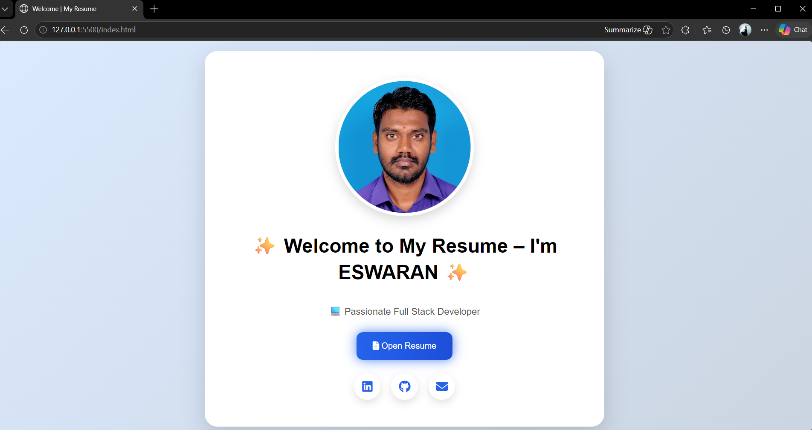
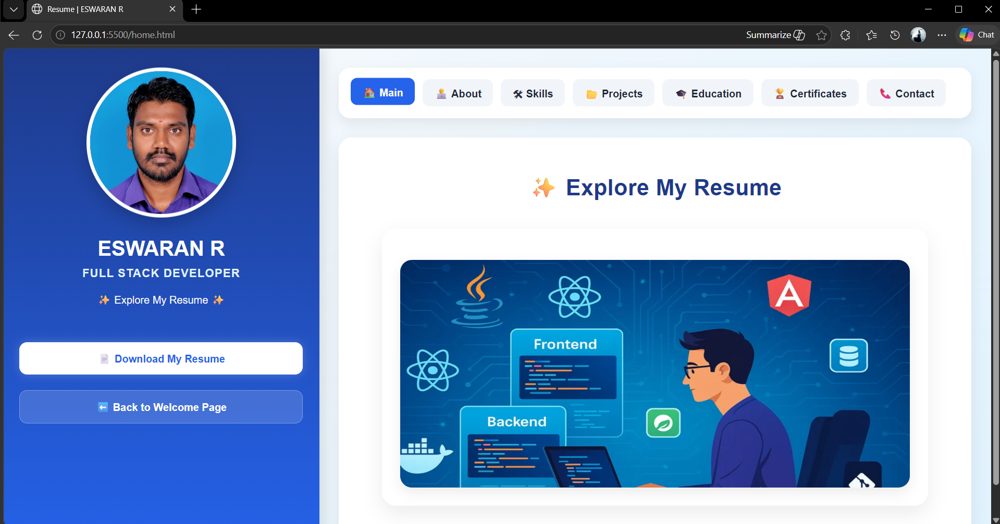
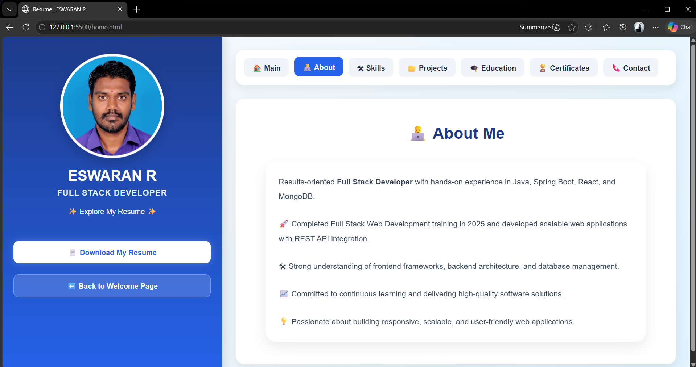
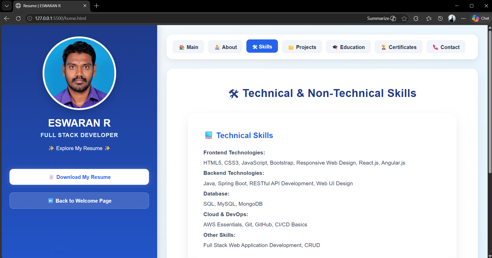
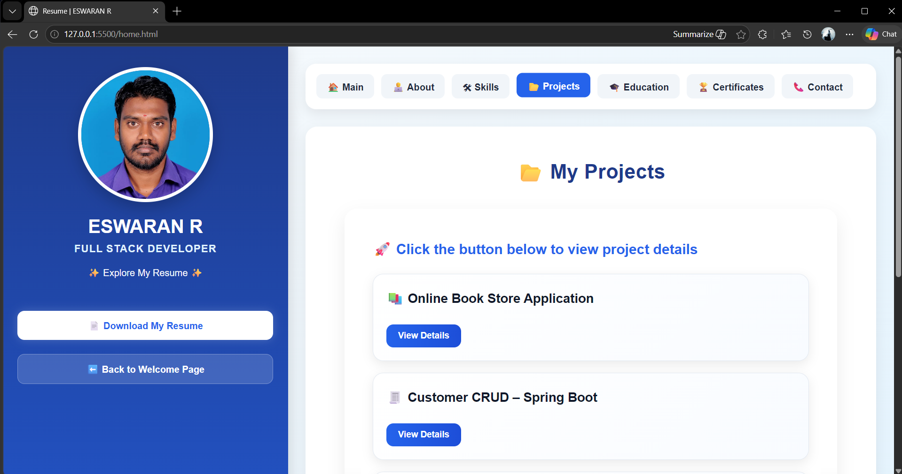
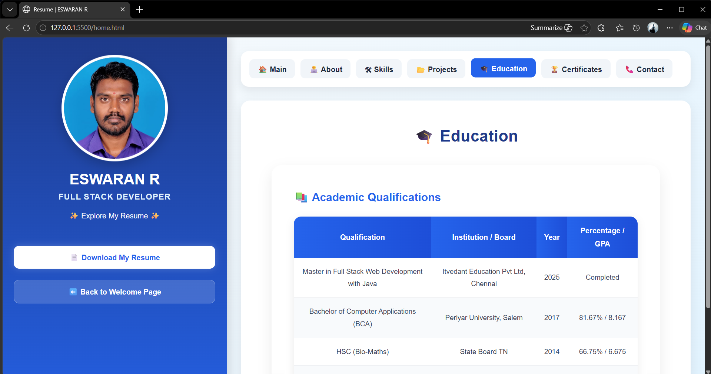
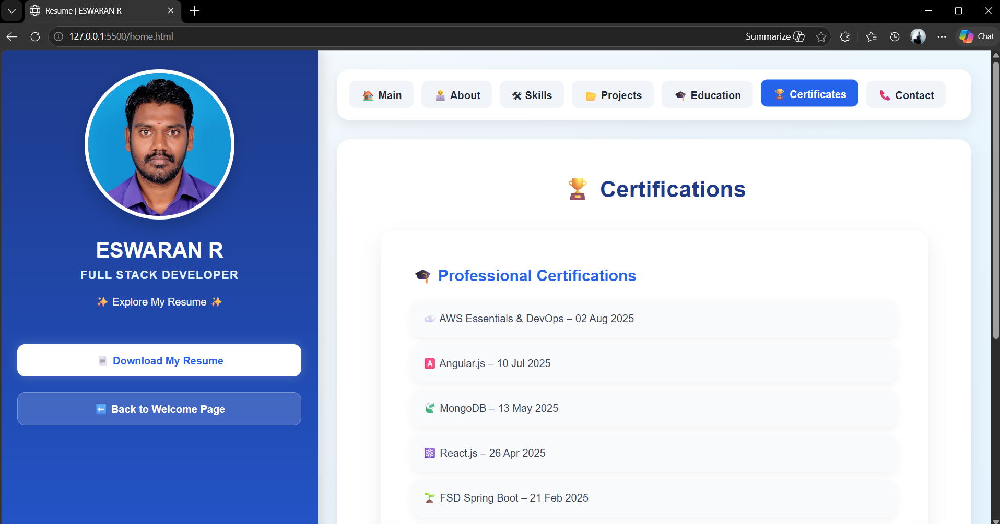
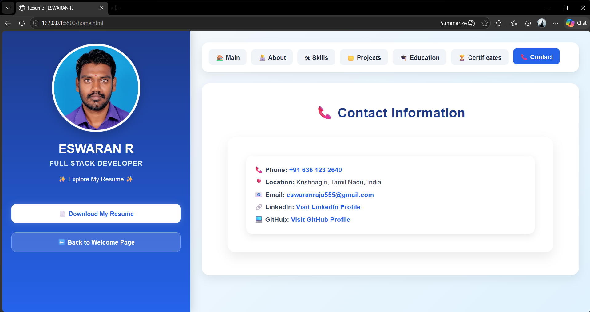

# 💼 ESWARAN R | Resume Portfolio Website

A modern and professional resume portfolio website built using **HTML, CSS, JavaScript**.

## 🚀 Live Features
- 🏠 Welcome landing page
- 👨‍💻 About Me
- 🛠 Technical & Non-Technical Skills
- 📂 Projects
- 🎓 Education
- 🏆 Certifications
- 📞 Contact Information
- 📄 Resume Download Button
- 📱 Fully Responsive Design

## 💻 Technologies Used
- HTML5
- CSS3
- JavaScript
- Font Awesome Icons

## 📂 Project Structure
```text
index.html
home.html
home.css
style.css
script.js
profile.jpg
banner.webp
images
README.md
```

## 📸 Project Screenshots

### 🏠 Welcome Page


### 🏡 Main Resume Home


### 👨‍💻 About Section


### 🛠 Skills Section


### 📂 Projects Section


### 🎓 Education Section


### 🏆 Certificates Section


### 📞 Contact Section



## 🌐 Deployment
Deployed using **GitHub Pages**

## 👨‍💻 Author
**Eswaran R**  
Full Stack Developer